# 优兔哥香港美食攻略

> 来源：<https://www.163.com/dy/article/GVP6A9QE0544QWKN.html>

**一、到香港哪里吃大餐？**

香港茶餐厅闻名世界，可以品尝到各国佳肴，常见菜式有西餐、中餐、东南亚菜，偶尔可见韩国料理、日本寿司和非洲巧克力。

这些美食餐厅坐落于繁华市中心的美食大楼里面，香港的富士大厦、建兴大厦、发利大厦是美食天堂。

香港茶餐厅文化：

（1）价格实惠：西餐600-800元，中餐400-600元，东南亚餐厅300-450元。

（2）味道甜美：菜的品相较佳，服务态度较好。

（3）选择众多：大大小小几十栋楼，几千个餐厅。

**二、怎么找美食****圣****地？**

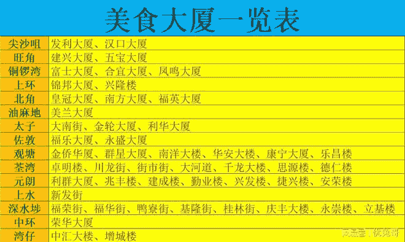

香港历史上的美食大厦三巨头是富士大厦、建兴大厦、香槟大厦。

其中香槟大厦已经关门了。现在的美食三巨头是富士大厦、建兴大厦、发利大厦。

**（1）富士大厦**

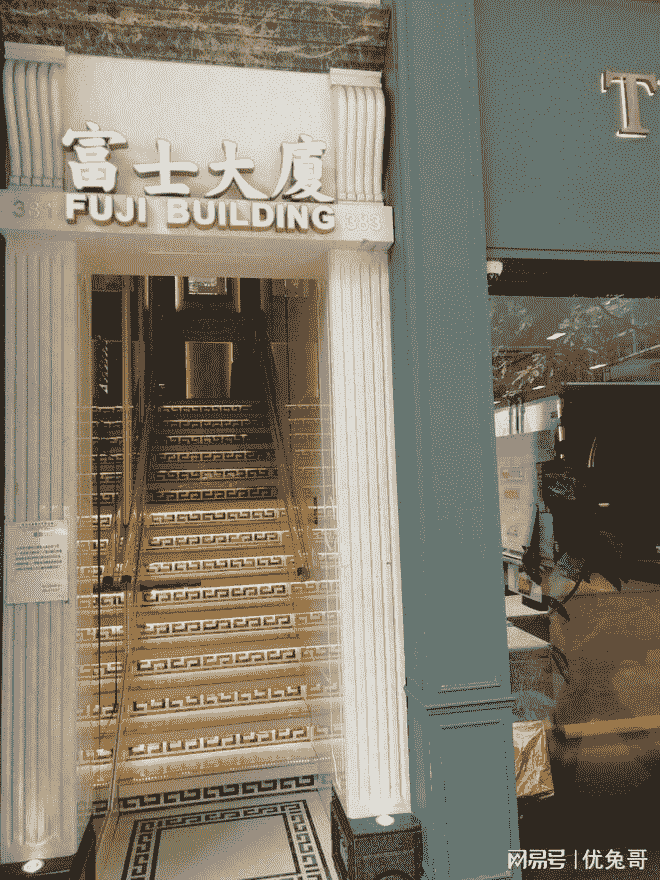

地址：地铁铜锣湾站C出口，香港湾仔区洛克道381-383号。

观光楼层：1-22楼（整栋楼都是）。每层楼大概10多个店。

富士大厦的装修较好，大厦里面的房间租金较贵，导致餐费通常较高。

富士大厦有中餐厅和西餐厅。中餐厅的品质较高，西餐厅一般位于高楼层（20-22楼）和低楼层（1-3楼）。

西餐厅以俄罗斯餐厅和乌克兰餐厅为主。

**（2）建兴大厦**

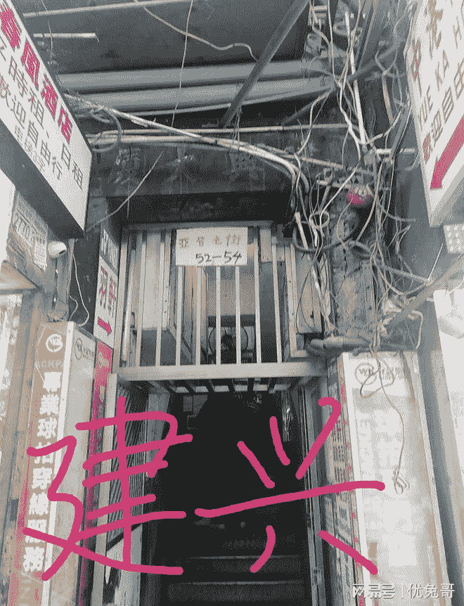

地址：地铁旺角站D3出口，香港油尖旺区亚皆老街52-54号。

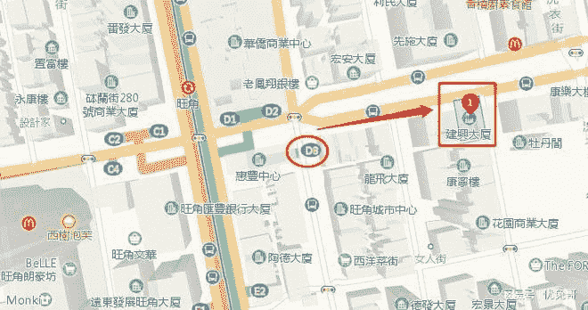

观光楼层：2-14楼（整栋楼都是）。每层楼大概30多个店。

建兴大厦的装修较差，楼龄很老。

建兴大厦的性价比很高，菜品质量与富士大厦一时瑜亮，价格却更便宜，所以广受推荐。

建兴大厦有不少俄罗斯、乌克兰西餐厅，喜欢吃西餐的单身狗一定不要错过。

中餐厅也一直有非常好的口碑，经常会遇到好的菜品，性价比很高。

**（3）发利大厦**

地址：地铁尖沙咀站N2出口，香港油尖旺区加拿芬道33-35号。

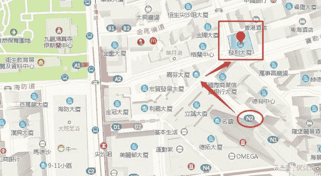

观光楼层：2-8楼（整栋楼都是）。每层楼大概40多个店。

发利大厦主打中餐厅和东南亚菜，很少见到西餐厅。发利大厦的中餐厅质量较好。

发利大厦每层楼的店非常多，距离建兴大厦较近。在尖沙咀逛街的朋友一定不要错过这两栋大厦。

**（4）合宜大厦**

地址：地铁铜锣湾站C出口，香港湾仔区洛克道474-476号。

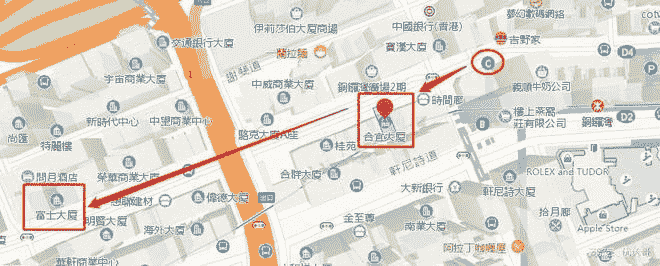

观光楼层：3-12楼（部分楼层有餐厅），每层楼大概10个店。

合宜大厦距离地铁口非常近，与最著名的富士大厦相距几百米。

合宜大厦的餐厅质量大多数情况下都比不上富士大厦，但是偶尔会遇到不错的好餐厅。

**（5）锦邦大厦**

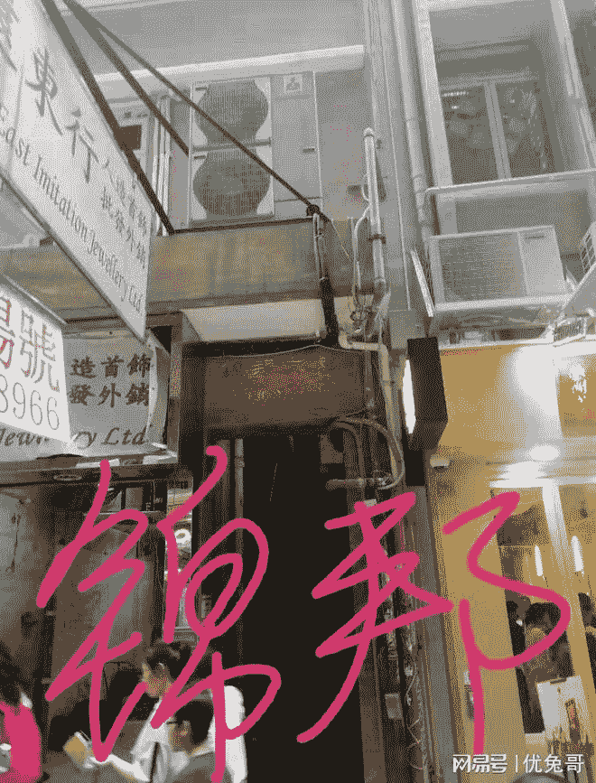

地址：地铁上环站E1出口，香港中环永吉街14-16号。

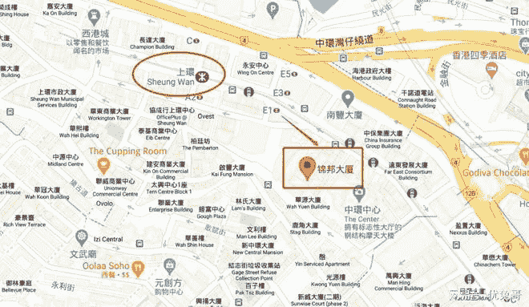

观光楼层：1-9楼（整栋楼都是）。每层楼大概20多个店。

锦邦大厦楼道较新，光线较好。

几乎都是中餐厅，整体质量比不上富士大厦、建兴大厦、发利大厦。

**（6）凤鸣大厦**

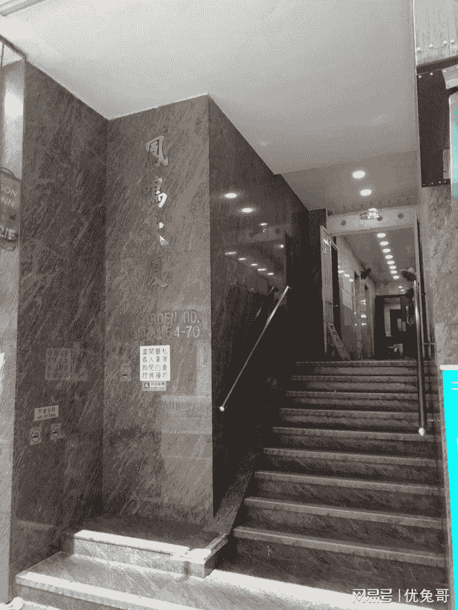

地址：地铁铜锣湾站F1出口，香港湾仔区希慎道15-31号。

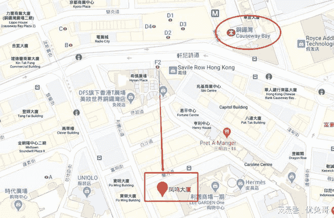

观光楼层：3楼、5楼。每层楼大概40个店。

凤鸣大厦主打东南亚菜，整体菜品质量比不上同处铜锣湾商圈的富士大厦。

**（7）福乐大厦**

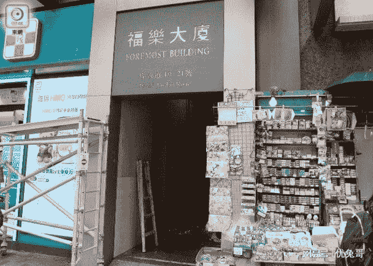

地址：地铁佐敦站A出口，香港油麻地佐敦道21号。

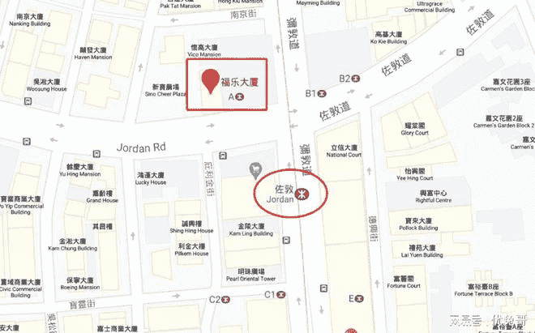

观光楼层：整栋楼都是。

福乐大厦主打香港本地菜。

**（8）五宝大厦**

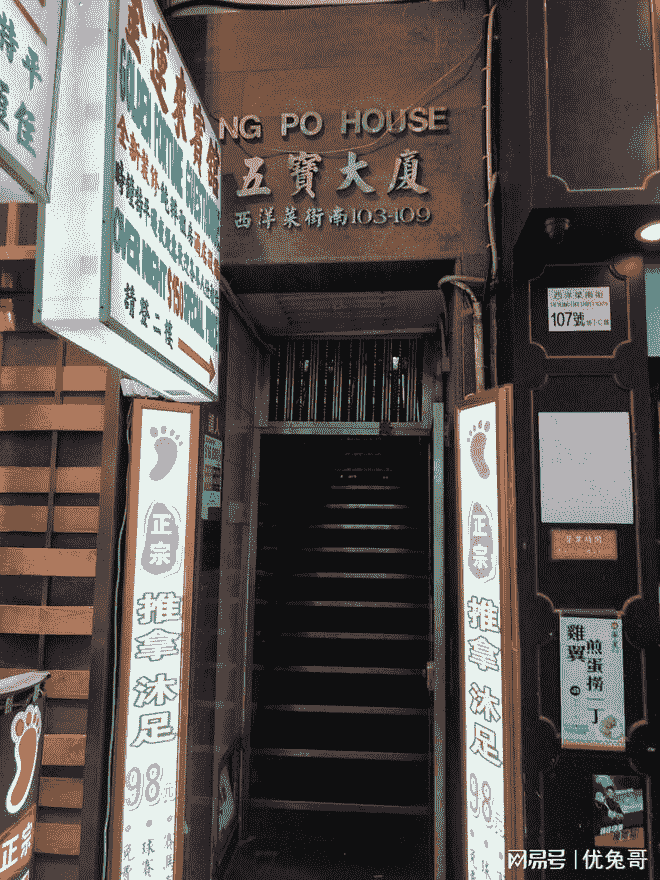

地址：地铁旺角站B3出口，香港旺角西洋菜南街103-109号。

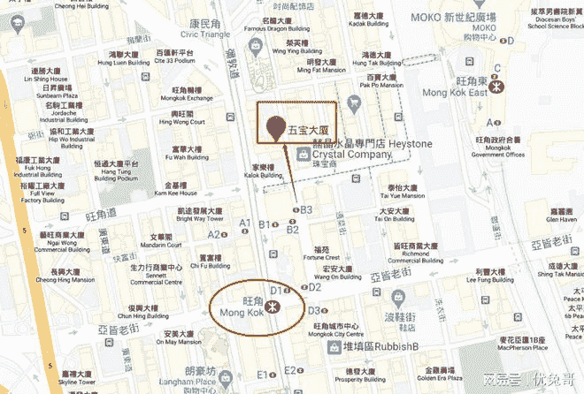

观光楼层：部分楼层。

五宝大厦性价比高。

**三、****扫****楼**

坐电梯到美食大厦的顶楼，然后一层一层爬楼梯往下逛。以富士大厦为例，坐电梯到顶楼22楼，然后走楼梯逐层扫楼。

不建议从1楼开始扫楼，往上爬楼梯很累。

只要看到门口牌子写着“请按钟”或“欢迎光临”，就大胆按门铃。

扫楼过程中，看到不错的餐厅一定要记下房间号，比如9楼B2。不然等你全部逛完，你一定想不起餐厅在哪个房。

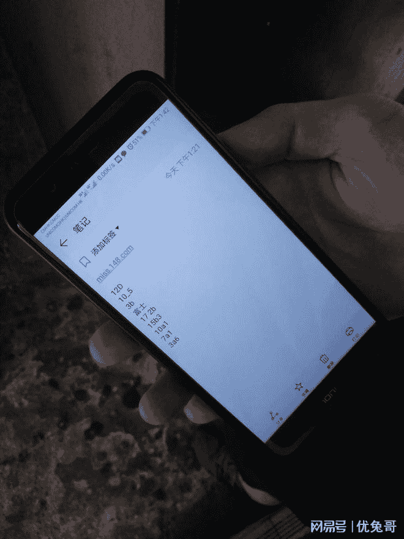

大部分餐厅在下午2点后开门营业，到了晚上6点几乎所有餐厅都对外营业。

下午4点到晚上9点之间是就餐高峰期。

**四、常见问题答疑**

1.菜品好吗？

中餐厅有粤菜、川菜、湘菜、贵州菜、云南菜、东北菜等等，西餐厅有俄罗斯菜、乌克兰菜、澳大利亚菜等等，种类繁多，要挑到好吃的，非常容易。

2.可以讲价吗？

可以。

3.怎么付费？

一般情况都是先就餐，后付费，给港币现金。有部分西餐厅会要求先付费，后就餐。

只有部分餐厅支持支付宝，且人民币折换成港币，是按照1:1折算，很坑。建议提前在国内换好港币现金。

香港到处都有外汇兑换点，但是汇率不高，不划算。

4.餐厅营业时间？

早上10点到凌晨3点之间。下午6点几乎所有餐厅都开门营业了。

客流高峰是下午4点到晚上9点。

5.哪栋大楼最好?

五星推荐：铜锣湾的富士大厦、尖沙咀的发利大厦、旺角的建兴大厦。

餐厅数量：发利大厦＞富士大厦＞建兴大厦＞锦邦大厦

餐厅质量：建兴大厦＞富士大厦＞发利大厦＞锦邦大厦

西餐数量：建兴大厦＞富士大厦＞合宜大厦

备注：

（1）上述数据仅供参考，具体情况会随着市场变化而发生变化。

（2）富士、建兴、发利大厦是最值得去的美食大楼。

6.如果我想吃西餐，去哪里?

一般情况，建兴大厦的西餐厅数量和质量都相对有保证，是首选。

富士大厦、发利大厦、合宜大厦也会有西餐厅。

7.如果我想吃中餐，去哪里?

建兴大厦、富士大厦、发利大厦。

除了上述三栋知名大厦，也可以考虑锦邦大厦、合宜大厦、皇冠大厦、金侨华厦、福乐大厦。

8.我想吃香港本地菜，去哪里？

福乐大厦、富士大厦、锦邦大厦、兴隆大厦、南方大厦、汉口大厦。其中福乐大厦最多。

9.香港的东南亚菜餐厅好吗？

总体来说不算很稳，不太干净卫生。

10.餐厅有雷吗？

整体而言，服务态度都挺好，服务质量不错。但也会有雷。

大多数店家的食材货真价实，没有假冒伪劣产品，真实度相当有保证。少数店家会货不对板。

11.就餐环境好吗？

餐厅非常注重卫生，都比较干净。

12.可以吃多久？

就餐时间为30分钟左右。

13.不会粤语怎么办？

在香港，无论是出行、购物、吃饭，都有很多工作人员会讲普通话。

富士大厦、建兴大厦等特色美食景点，通用普通话。
